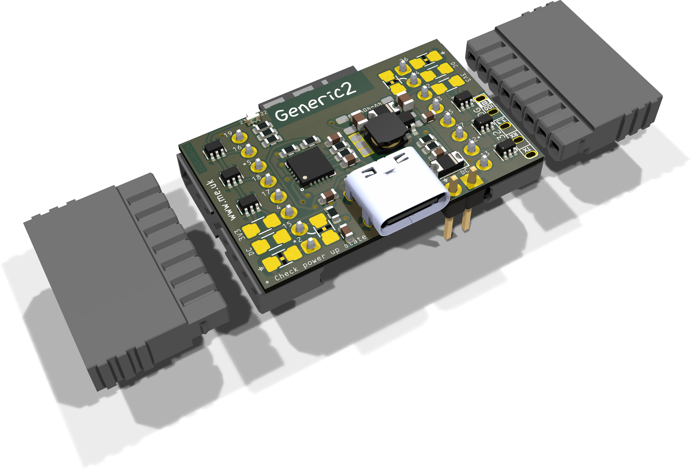
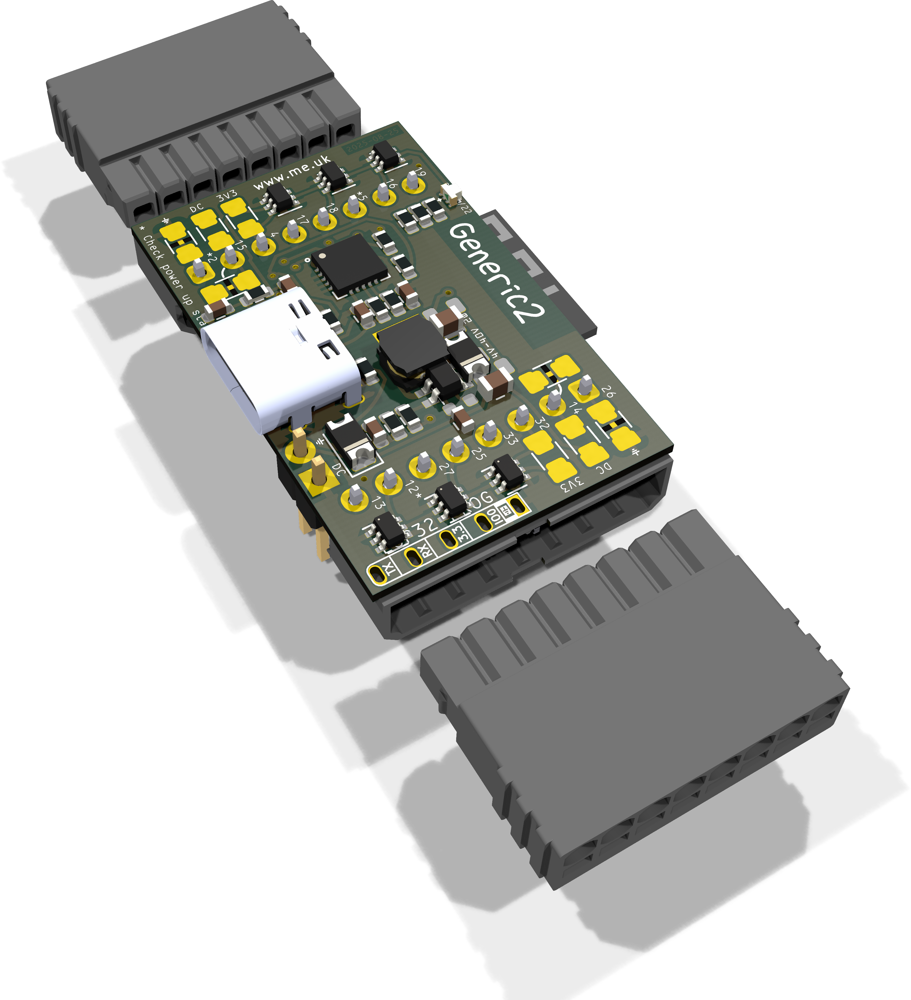
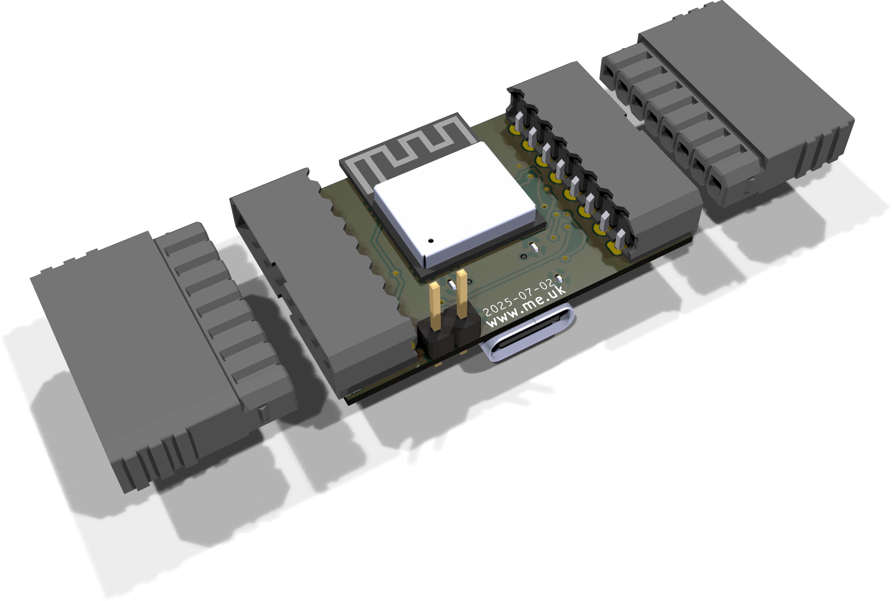

# Generic2

## Trademark

This is an open source project, but bear in mind you cannot sell boards bearing the Andrews & Arnold Ltd name, the A&A logo, the registered trademark AJK logo, or the GS1 allocated EANs assigned to Andrews & Arnold Ltd.

## PCB Designs

These files are for use with [KiCAD](https://www.kicad.org).

- [Generic2](Generic2.kicad_pro)
## 3D

3D case designs are normally automatically created from the PCB so as to ensure correct details and placement of apertures, etc.

- [Generic2](Generic2.stl)

## Images

---

*Auto generated README.md 2025-08-25T14:29:06*
