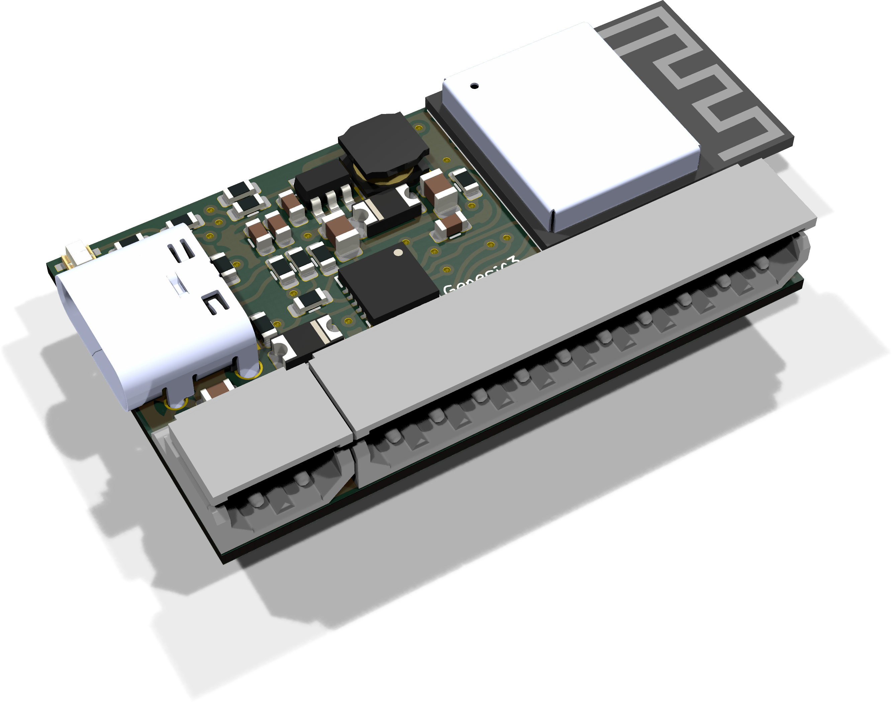
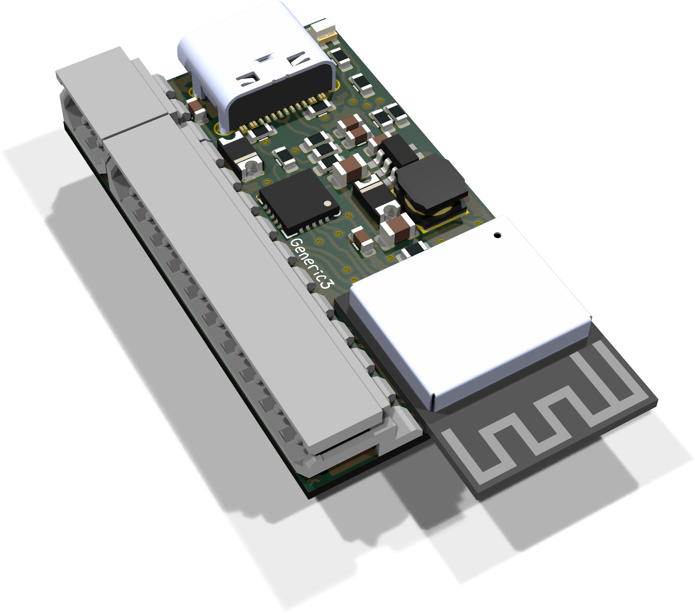
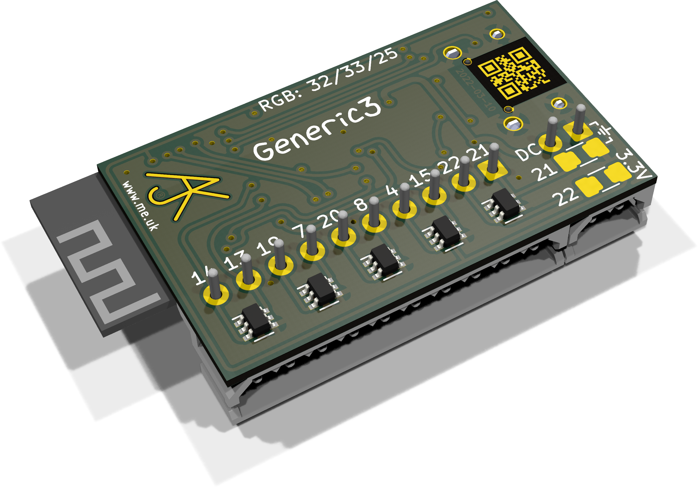

# Generic3

These files are for use in [KiCad](https://www.kicad.org).

## Trademark

This is an open source project, but bear in mind you cannot sell boards bearing the Andrews & Arnold Ltd name, the A&A logo, the registered trademark AJK logo, or the GS1 allocated EANs assigned to Andrews & Arnold Ltd.

## 3D

3D case designs are normally automatically created from the PCB so as to ensure correct details and placement of apertures, etc.

- [Generic3](Generic3.stl)

## Images

*Auto generated 2025-08-25T12:45:23*
