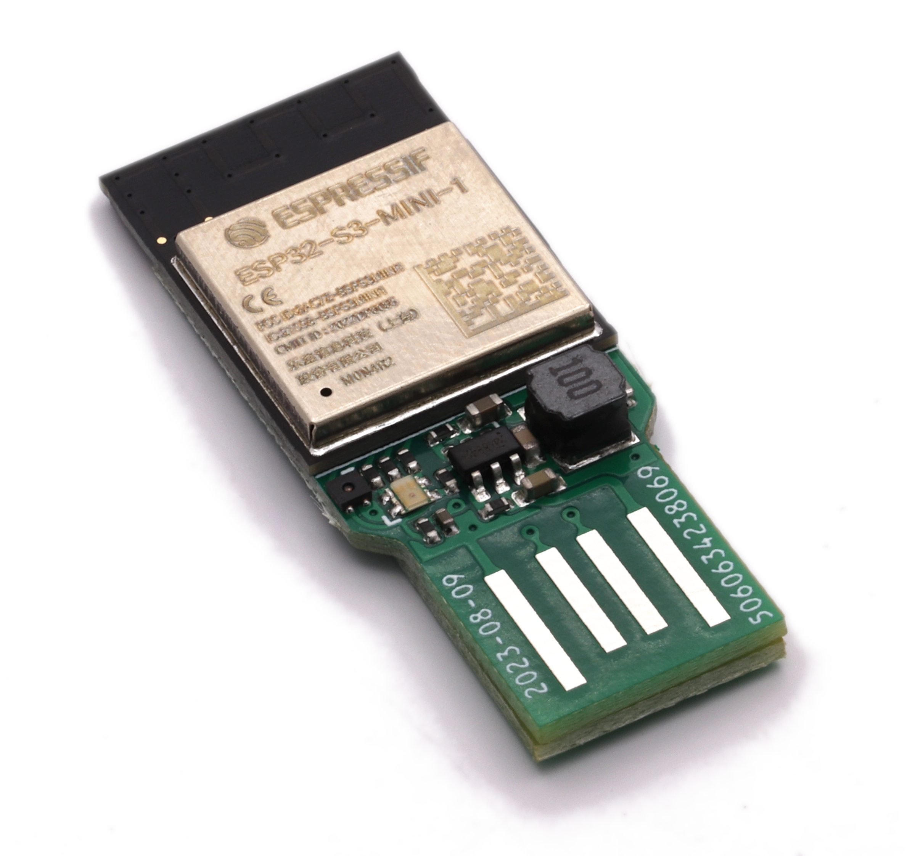

# USBA board

A small PCB design to plug in directly to an old school USB socket for power. Does not connect to USB data - maybe I'll do one that does some time.

Includes power supply and RGB LED.

[Buy](https://www.aa.net.uk/etc/circuit-boards/)

## Programming

Use a [Tasmotizer board](https://github.com/revk/Tasmotizer-PCB) to program using the 5 pads.

