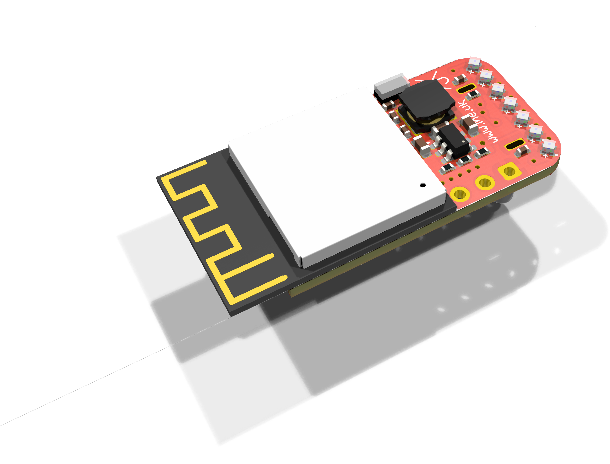
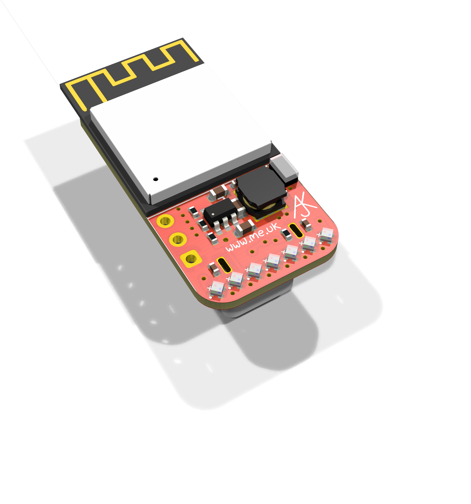
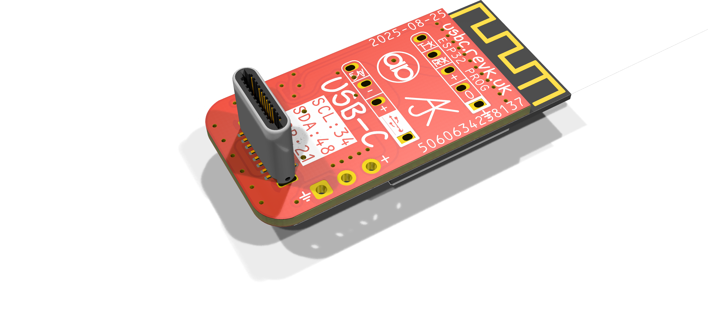

# USBC

These files are for use in [KiCad](https://www.kicad.org).

## Trademark

This is an open source project, but bear in mind you cannot sell boards bearing the Andrews & Arnold Ltd name, the A&A logo, the registered trademark AJK logo, or the GS1 allocated EANs assigned to Andrews & Arnold Ltd.

## Images

*Auto generated 2025-08-24T13:46:48*
